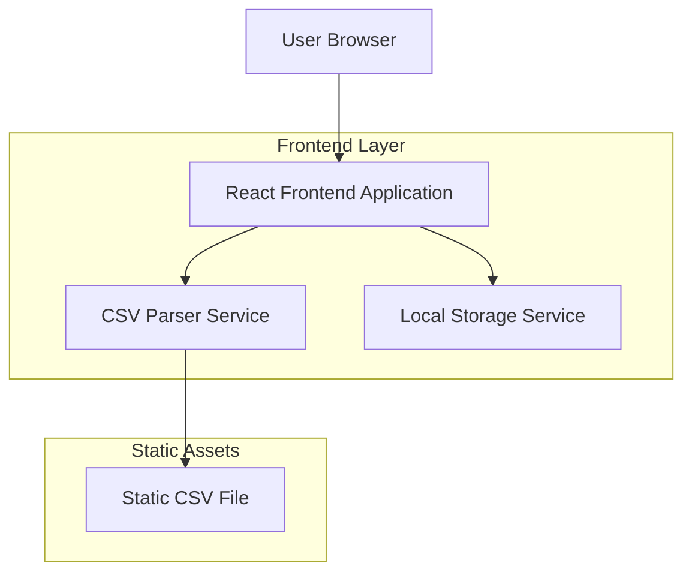
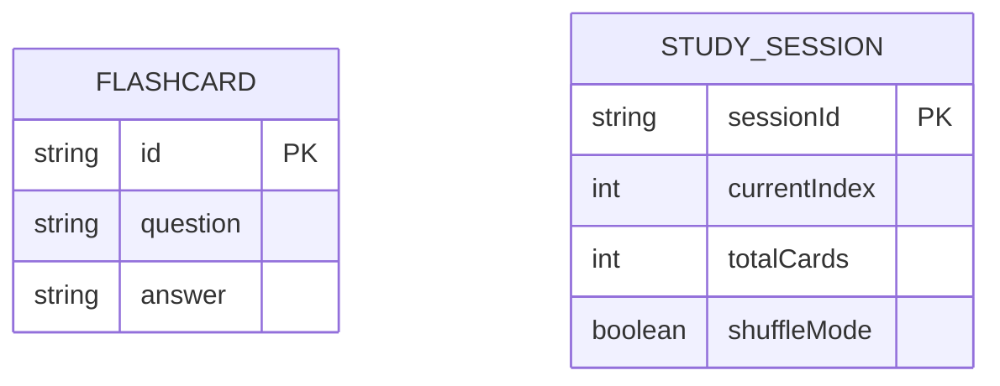

## 1. Architecture design



## 2. Technology Description
- Frontend: React@18 + tailwindcss@3 + vite
- Initialization Tool: vite-init
- Backend: None (aplicación cliente-side pura)
- Gestión de estado: Context API de React
- Almacenamiento: LocalStorage del navegador

## 3. Route definitions
| Route | Purpose |
|-------|---------|
| / | Página de carga, permite seleccionar archivo CSV |
| /study | Página de estudio principal con flashcards |
| /progress | Página de visualización de progreso |

## 4. API definitions
### 4.1 CSV Processing API
```
POST /api/parse-csv (simulado - cliente-side)
```

Request:
| Param Name| Param Type  | isRequired  | Description |
|-----------|-------------|-------------|-------------|
| file      | File        | true        | Archivo CSV con formato pregunta/respuesta |

Response:
| Param Name| Param Type  | Description |
|-----------|-------------|-------------|
| cards     | Array       | Array de objetos con pregunta y respuesta |
| total     | number      | Número total de tarjetas |

Example
```javascript
{
  "cards": [
    {"question": "¿Capital de Francia?", "answer": "París"},
    {"question": "¿2+2?", "answer": "4"}
  ],
  "total": 2
}
```

### 4.2 Local Storage Types
```typescript
interface FlashcardData {
  question: string;
  answer: string;
  id: string;
}

interface StudyProgress {
  currentIndex: number;
  totalCards: number;
  viewedCards: Set<string>;
  shuffleMode: boolean;
}
```

## 5. Server architecture diagram
No aplica - aplicación cliente-side sin servidor.

## 6. Data model
### 6.1 Data model definition


### 6.2 Data Definition Language
No se requiere base de datos. Los datos se almacenan en LocalStorage del navegador con el siguiente esquema:

```javascript
// Estructura de LocalStorage
localStorage.setItem('flashcards-data', JSON.stringify({
  cards: [
    {id: '1', question: '...', answer: '...'},
    // ... más tarjetas
  ],
  metadata: {
    totalCards: 50,
    createdAt: '2026-01-19T10:00:00Z',
    filename: 'mispreguntas.csv'
  }
}));

localStorage.setItem('study-progress', JSON.stringify({
  currentIndex: 0,
  viewedCards: ['1', '2', '3'],
  shuffleMode: false,
  lastAccessed: '2026-01-19T10:30:00Z'
}));
```