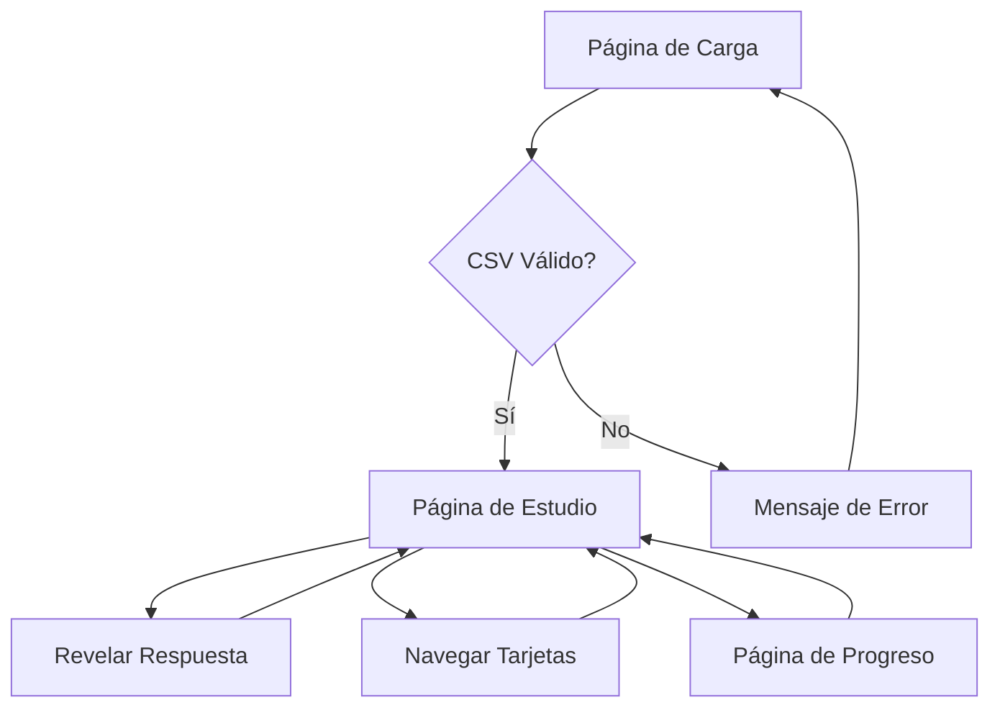

## 1. Product Overview
Aplicación web de flashcards educativas que permite cargar archivos CSV con preguntas y respuestas para facilitar el aprendizaje interactivo. Los usuarios pueden estudiar de forma eficiente, una tarjeta a la vez, con navegación simple y retroalimentación inmediata.

Diseñada para estudiantes y profesionales que necesitan memorizar información de forma efectiva, transformando contenido estático en experiencias de aprendizaje dinámicas.

## 2. Core Features

### 2.1 User Roles
No se requieren roles de usuario para esta aplicación. Es una herramienta abierta sin autenticación.

### 2.2 Feature Module
La aplicación de flashcards consiste en las siguientes páginas principales:
1. **Página de carga**: Permite seleccionar y cargar el archivo CSV con preguntas y respuestas.
2. **Página de estudio**: Muestra las flashcards de forma individual con opciones para revelar respuestas y navegar entre tarjetas.
3. **Página de progreso**: Visualiza el avance del estudio y estadísticas básicas.

### 2.3 Page Details
| Page Name | Module Name | Feature description |
|-----------|-------------|---------------------|
| Página de carga | Selector de archivo | Permite seleccionar archivo CSV local con formato pregunta/respuesta |
| Página de carga | Validador CSV | Verifica que el archivo tenga exactamente 2 columnas sin cabecera |
| Página de estudio | Flashcard display | Muestra la pregunta ocupando todo el espacio disponible |
| Página de estudio | Reveal button | Botón prominente para mostrar/ocultar la respuesta |
| Página de estudio | Navigation controls | Botones para tarjeta anterior/siguiente y contador de progreso |
| Página de estudio | Shuffle mode | Opción para mezclar el orden de las tarjetas |
| Página de progreso | Progress indicator | Muestra tarjetas vistas y total de tarjetas |
| Página de progreso | Reset option | Permite reiniciar el progreso y volver a empezar |

## 3. Core Process
El flujo principal de la aplicación comienza cuando el usuario carga un archivo CSV. El sistema valida el formato y procesa los datos. Luego el usuario accede al modo de estudio donde puede navegar por las flashcards, revelar respuestas y marcar su progreso. El sistema mantiene el estado actual del estudio incluso si el usuario recarga la página.

## 4. User Interface Design

### 4.1 Design Style
- **Colores primarios**: Azul profesional (#2563EB) para elementos interactivos
- **Colores secundarios**: Gris neutro (#6B7280) para texto y bordes
- **Fondo**: Blanco limpio (#FFFFFF) con sombras sutiles
- **Botones**: Estilo redondeado con bordes de 8px y sombra suave
- **Tipografía**: Inter o system-ui, tamaños base 16px para lectura cómoda
- **Iconos**: Emoji estándar o iconos minimalistas de lucide-react
- **Layout**: Diseño centrado con tarjetas de máximo 600px de ancho

### 4.2 Page Design Overview
| Page Name | Module Name | UI Elements |
|-----------|-------------|-------------|
| Página de carga | Selector de archivo | Área drag-and-drop de 400x200px con borde punteado, texto descriptivo y botón de explorar |
| Página de estudio | Flashcard display | Tarjeta central de 500x300px con esquinas redondeadas, sombra elegante y animación suave |
| Página de estudio | Reveal button | Botón grande (200x50px) en posición fija inferior, color primario con hover effect |
| Página de estudio | Navigation controls | Botones pequeños en lateral con iconos de flecha, contador de tarjetas en centro superior |
| Página de progreso | Progress bar | Barra de progreso horizontal de 80% ancho con porcentaje numérico |

### 4.3 Responsiveness
Diseño desktop-first con adaptación responsive para tablets y móviles. En dispositivos móviles, las tarjetas ocuparán el 90% del ancho disponible y los botones serán más grandes para facilitar la interacción táctil.

### 4.4 3D Scene Guidance
No aplica para esta aplicación.